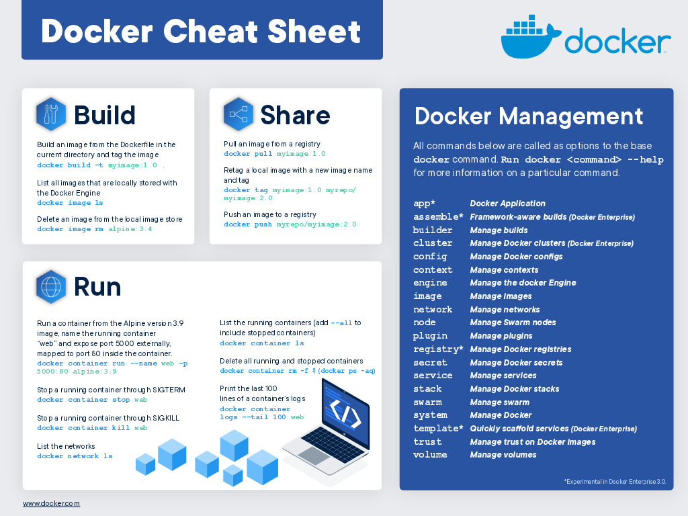

# Topics

- [x] Introduction to Docker and its architecture
- [x] Managing docker as a service
- [x] Docker CLI - Deploy your first docker containers
- [x] Docker CLI - Docker commands II
- [x] Deploying a web application (Jenkins) as docker container
- [x] Docker Networks [video](https://www.youtube.com/watch?v=c6Ord0GAOp8) [video](https://www.youtube.com/watch?v=Yr6-2ddhLVo)
	- [x] Network snadbox
	- [x] Endpoint
	- [x] network layer
- [x] Communicating between two docker containers [video](https://www.youtube.com/watch?v=y_XFIidjtEs)
- [x] Docker Volumes
- [ ] Docker Bind Volumes

# Cheat sheet

# Other Resources
[github](https://github.com/wsargent/docker-cheat-sheet)
